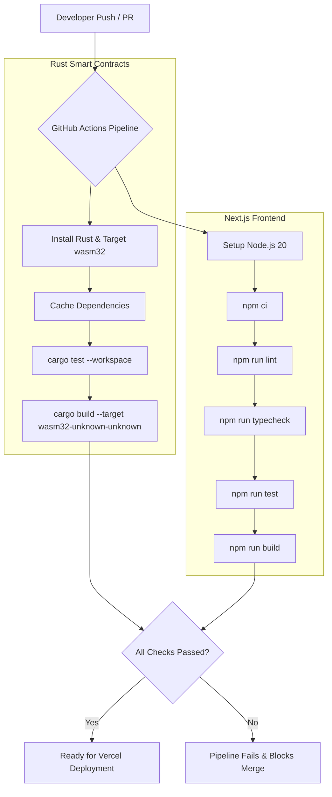

# Atlas

**Deposit crypto. Borrow stablecoins. Keep your upside.**

Atlas is an overcollateralized lending protocol built on [Stellar](https://stellar.org)'s Soroban smart contract
platform. Deposit XLM as collateral, borrow a test USDC stablecoin against it, repay whenever you like, and
withdraw once your vault is healthy. Unhealthy vaults can be liquidated by anyone in exchange for a collateral
bonus — all fully on-chain, on Stellar Testnet.

This is a complete, working MVP: five deployed Soroban contracts, a Next.js frontend that talks to them
directly (no backend, no database), 63 passing contract tests, and a Playwright/Vitest frontend test suite.

## Overview

| | |
|---|---|
| Collateral asset | XLM |
| Borrow asset | Atlas Test USDC (SEP-41, permissionless faucet) |
| Max LTV | 60% |
| Liquidation threshold | 80% |
| Liquidation bonus | 5% |
| Borrow interest | 5% simple annual, accrued continuously |
| Network | Stellar Testnet |

## Live deployment

| Contract | Address |
|---|---|
| Vault | `CCFYMKQ7RMZAHSX5OIP7S3O4UPXWMFAWYDJBWT23OJV4MODXPFMKMPBX` |
| Oracle | `CAEAARMY73YIAKNF6RX67JAOSS4CLVMNXXOTUZLUMEO6OQQDN73KP7PA` |
| Treasury | `CBVLBJCDYAK2RBGBFFEKNKY7L5PJLKIPQGHUP5HV5VXSMMTKL6C72DEA` |
| Liquidation | `CDU4HVH7KD4IILX3DNONXDLS4CTNILIXEQKKNBJ3YHBB26FNNQ3JKQXC` |
| USDC (test) token | `CBCM2JD3B2QYJ62KVB322WOBKL42IJ3PBUTHU2WQGEGUZUVZZB3XBUEZ` |
| XLM (native SAC) | `CDLZFC3SYJYDZT7K67VZ75HPJVIEUVNIXF47ZG2FB2RMQQVU2HHGCYSC` |

These addresses (and the network config) live in [`deployed_addresses.json`](./deployed_addresses.json) and are
copied into [`web/lib/contracts/deployed_addresses.json`](./web/lib/contracts/deployed_addresses.json) for the
frontend to import directly — no environment variables required to run the app against the live deployment.

## Architecture

Five Soroban contracts compose the protocol. See [`docs/ARCHITECTURE.md`](./docs/ARCHITECTURE.md) and
[`docs/SMART_CONTRACTS.md`](./docs/SMART_CONTRACTS.md) for the full write-up.

```
                      ┌─────────────┐
                      │   Oracle    │  admin-pushed USD prices
                      └──────┬──────┘
                             │ get_price
                      ┌──────▼──────┐        seize()        ┌──────────────┐
      deposit/        │             │◄──────────────────────┤  Liquidation │
      withdraw/  ────►│    Vault    │                       └──────┬───────┘
      borrow/         │ (per-user   │  disburse/record_fee         │ liquidate()
      repay           │  positions) ├──────────────────────►┌──────▼───────┐
                      └─────────────┘                       │              │
                                                              │   Treasury   │◄── fund()
                                                              │ (USDC pool)  │
                                                              └──────────────┘
```

- **Vault** — holds every user's collateral custody and debt bookkeeping in one deployed instance.
- **Oracle** — admin-pushed USD prices (7-decimal fixed point), swappable for a decentralized feed later.
- **Treasury** — custodies USDC liquidity; only the Vault may pull from it to fund borrows.
- **Liquidation** — orchestrates atomic liquidations of unhealthy vaults.
- **Token** — a SEP-41 test USDC contract with an admin mint and a permissionless faucet.

The frontend reads every value directly from these contracts over Soroban RPC and only writes through the
connected wallet's signature — there is no backend server or database in the request path. Historical charts
(collateral/debt over time) are reconstructed from on-chain contract events via `getEvents`, not a separate
indexer.

## Folder structure

```
atlas/
├── contracts/            Soroban contracts (Rust workspace)
│   ├── oracle/
│   ├── token/             SEP-41 test USDC + faucet
│   ├── treasury/
│   ├── vault/              core lending logic
│   └── liquidation/
├── scripts/
│   └── deploy.sh           builds, deploys, wires, and seeds all 5 contracts on testnet
├── web/                   Next.js 15 / React 19 frontend
│   ├── app/                routes (App Router)
│   │   ├── page.tsx          landing page
│   │   ├── docs/              in-app documentation
│   │   └── (app)/             authenticated app shell: dashboard, vault, liquidations, stats, settings, deposit/borrow/repay/withdraw
│   ├── components/          UI components (layout, dashboard, vault, liquidation, charts, shared, landing, ui)
│   ├── hooks/                TanStack Query hooks (reads) + mutation hooks (writes)
│   ├── lib/
│   │   ├── contracts/          typed contract client layer (@stellar/stellar-sdk)
│   │   ├── wallet/              Stellar Wallets Kit integration
│   │   ├── format.ts            fixed-point <-> display formatting
│   │   └── protocol-math.ts     client-side mirror of the Vault's math, for instant previews
│   ├── types/                 shared TypeScript types
│   └── tests/                  Vitest unit/component tests + Playwright e2e tests
├── docs/                  PRD, architecture, contracts, API, security, roadmap
├── deployed_addresses.json
└── Cargo.toml             workspace root
```

## Local development

### Prerequisites

- Rust (stable) + `wasm32v1-none` target: `rustup target add wasm32v1-none`
- [Stellar CLI](https://developers.stellar.org/docs/tools/cli/install-cli) `stellar` >= 23
- Node.js 20+ and npm

### Contracts

```bash
# run all contract unit + integration tests (57 tests)
cargo test --workspace

# build every contract to wasm
stellar contract build
```

### Deploying (or redeploying) to Testnet

```bash
stellar keys generate atlas-admin --network testnet --fund   # one-time
./scripts/deploy.sh
```

This builds all 5 contracts, deploys them, wires Treasury ↔ Vault ↔ Liquidation together, seeds the Oracle with
starting prices, mints and deposits initial USDC liquidity into the Treasury, and writes
`deployed_addresses.json` (which is also copied to `web/lib/contracts/deployed_addresses.json` for the
frontend).

### Frontend

```bash
cd web
npm install
npm run dev
```

Open http://localhost:3000. Connect Freighter (or xBull/Lobstr) set to **Testnet**. Use the in-app faucet on the
Dashboard to claim test XLM (via Friendbot) and test USDC (via the token contract's permissionless faucet).

## CI/CD Pipeline

The project implements a comprehensive CI/CD pipeline via GitHub Actions that automatically tests and builds both the Rust smart contracts and the Next.js frontend on every push and pull request.



## Testing

```bash
# Contracts
cargo test --workspace

# Frontend unit/component tests
cd web && npm run test

# Frontend e2e tests (spins up the dev server automatically)
cd web && npm run test:e2e
```

### Live-network verification scripts

Two additional scripts exercise the actual `web/lib/contracts` pipeline (the same code the React hooks call)
against the live Testnet deployment, using throwaway keypairs generated fresh in-process — no stored secrets
involved:

```bash
cd web
npm run verify:flow         # faucet -> deposit -> borrow -> repay -> withdraw
npm run verify:liquidation  # borrow -> admin crashes the price -> a second wallet liquidates it
```

These caught two real Soroban-specific bugs during development (a transaction-footprint mismatch and an
authorization-argument mismatch, both arising from interest accruing between when a transaction is simulated
and when it executes) that the in-memory `cargo test` suite couldn't reproduce. See `docs/SECURITY.md` for
details.

## Documentation

- [`docs/PRD.md`](./docs/PRD.md) — product requirements
- [`docs/ARCHITECTURE.md`](./docs/ARCHITECTURE.md) — system architecture
- [`docs/SMART_CONTRACTS.md`](./docs/SMART_CONTRACTS.md) — contract-by-contract reference
- [`docs/API.md`](./docs/API.md) — frontend contract-client API reference
- [`docs/SECURITY.md`](./docs/SECURITY.md) — threat model and mitigations
- [`docs/ROADMAP.md`](./docs/ROADMAP.md) — what's next

## Disclaimer

Atlas is an educational MVP running entirely on Stellar Testnet. All assets (including "USDC") are test tokens
with no real-world value. Nothing here is financial advice.
